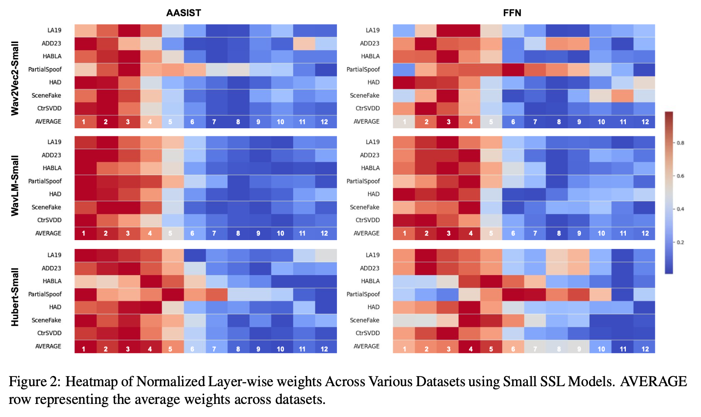
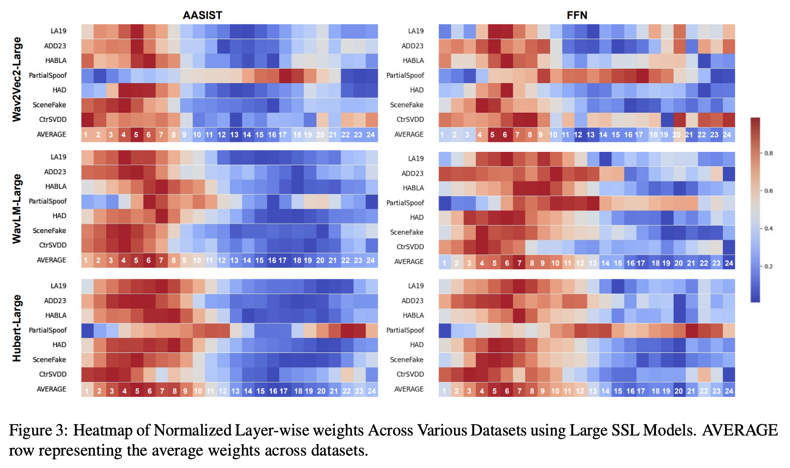

# Comprehensive Layer-wise Analysis of SSL Models for Audio Deepfake Detection

[](https://opensource.org/licenses/MIT)

This repository contains the official implementation of the paper:  
**"Comprehensive Layer-wise Analysis of SSL Models for Audio Deepfake Detection"** (NAACL Findings 2025).  
[[Paper]](https://arxiv.org/abs/2502.03559) 

---

## Abstract
This work conducts a systematic layer-wise analysis of self-supervised learning (SSL) models (e.g., Wav2Vec2, Hubert, WavLM) for detecting audio deepfakes across multilingual datasets (English, Chinese, Spanish), partial/song/scene-based deepfakes, and varying acoustic conditions. Key findings include:
- **Lower layers** (1-6 for small models, 1-12 for large models) provide the most discriminative features for detection.
- Reduced-layer models achieve **competitive performance** while lowering computational costs.
- Results generalize across languages (En, Zh, Es) and deepfake scenarios (full/partial/song/scene).

### Weights Analysis



---

## Installation
1. Clone the repository:
   ```bash
   git clone [https://github.com/Yaselley/SSL_Layerwise_Deepfake](https://github.com/Yaselley/SSL_Layerwise_Deepfake)
   cd [SSL_Layerwise_Deepfake](SSL_Layerwise_Deepfake)
   ```
   

### Install dependencies

To install the required dependencies, run the following command:

```bash
pip install -r requirements.txt
```

## Datasets

Publicly available datasets used in this work:

- **ASVspoof 2019 (LA19)**: [Link](https://www.asvspoof.org/index2019.html)
- **ASVspoof 2021 (LA21/DF21)**: [Link](https://www.asvspoof.org/index2021.html)
- **ADD23**: [Link](http://addchallenge.cn/)
- **HABLA**: [Link](https://www.isca-archive.org/interspeech_2023/tamayoflorez23_interspeech.pdf)
- **PartialSpoof**: [Link](https://github.com/nii-yamagishilab/PartialSpoof)
- **SceneFake**: [Link](https://arxiv.org/abs/2211.06073)
- **CtrSVDD**: [Link](https://arxiv.org/abs/2406.02438)

## Usage

### Replicating Experiments

Each dataset has a dedicated script. Example for ASVspoof 2019 (LA19):

```bash
python main.py \
  --seed 42 \
  --model w2v \          # Options: w2v, hubert, wavlm
  --small \              # Use small SSL model variant
  --n_layers 6 \          # Number of transformer layers (e.g., 6 for small models)
  --back FFN             # Backend classifier: FFN or AASIST
```

## Other Scripts

- Scene-based deepfakes: `main_sceneFake.py`
- Spanish (HABLA): `main_spanish.py`
- Partial deepfakes: `main_partial.py`

## Analysis

- Heatmaps (layer-wise weights) and tables are generated in the `analysis/` folder.

## Conclusion

- Lower SSL layers are critical for detecting artifacts in synthetic audio.
- Reducing layers (e.g., 4-6 for small models) achieves competitive performance while improving inference speed by 2-3×.
- Models generalize across languages and deepfake types, offering practical solutions for real-world deployment.

## Citation

```bibtex
@misc{kheir2025comprehensivelayerwiseanalysisssl,
  title={Comprehensive Layer-wise Analysis of SSL Models for Audio Deepfake Detection}, 
  author={Yassine El Kheir and Youness Samih and Suraj Maharjan and Tim Polzehl and Sebastian Möller},
  year={2025},
  eprint={2502.03559},
  archivePrefix={arXiv},
  primaryClass={eess.AS},
  url={https://arxiv.org/abs/2502.03559}, 
}
```
